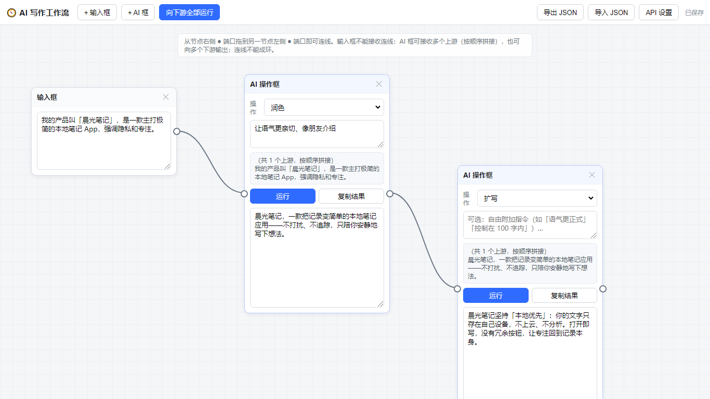

# AI 写作工作流（AI Writing Workflow）

一个**纯前端、零后端**的可视化写作流水线工具。用三种元素搭一条写作流：

- **输入框**：存放你的原始文本（信息源，不能接收连线）。
- **带箭头的路径**：把上游信息输送到下游。
- **AI 操作框**：接收上游文本后调用大模型做 **润色 / 扩写 / 缩写 / 概括 / 点评 / 续写**，也支持自由附加指令。

一个 AI 框可接收**多个上游**（按顺序拼接）并向**多个下游**输出；连线不能成环。所有内容存在你自己的浏览器里，不上传任何服务器。

## 预览

## 怎么用

1. 点「API 设置」，填入任意 OpenAI 兼容接口（默认 DeepSeek）：
   - Base URL：`https://api.deepseek.com/v1`
   - API Key：你自己的密钥
   - 模型名：`deepseek-chat`
2. 「+输入框」写原文 → 从它右侧 ● 拖到 AI 框左侧 ● 连线 → 点 AI 框「运行」。
3. AI 结果可继续拖给下一个 AI 框，串成流水线；也可「向下游全部运行」一键级联。
4. 工作流自动存浏览器本地；可「导出 / 导入 JSON」备份与分享。
5. 画布导航：用**鼠标滚轮**平移、**在空白处按住拖拽**可任意上下左右查看（Shift+滚轮横向）；工具栏「适配视图」一键看全整图、「1:1」恢复原比例编辑。

## 技术说明

- 单页静态站：`index.html` + `styles.css` + `app.js`，**无构建步骤、无依赖**，双击即可打开。
- 大模型调用走 OpenAI 兼容 `/chat/completions`，`stream:true` 流式输出（浏览器用 `fetch` + `ReadableStream` 解析 SSE）。
- 密钥只存浏览器 `localStorage`，不会进入代码或服务器。
- 数据隔离：每个访客的浏览器各自独立，互不可见。

## 在线试用

无需安装，直接打开即可使用（内容只存在你自己的浏览器里）：

**https://264ea8cb205240aaaf4a9dd27436bb96.app.codebuddy.work**

## 作者说

目前只是用 AI 搭了个基本框架，其他功能还在规划中。有想法的朋友可以在仓库的 **Discussions（讨论区）** 提出来哈，一起把它做得更好～

## 更新记录

- **画布自由平移导航**：支持鼠标滚轮平移（Shift+滚轮横向移动）、在画布空白处按住拖拽平移，可任意上下左右查看大图；工具栏「适配视图」一键缩放看全整图、「1:1」恢复原比例编辑，缩放下连线与拖拽仍精准。
- **修复导入布局混乱（节点重叠）**：重构导入文档的布局算法——链式模式改为「输入框 ↔ AI 框」**左右横排**（不再上下叠放），彻底消除纵向重叠；两种模式均改为**动态行高**（根据内容长度估算）+ **动态列数**（根据画布宽度自适应）；行/列间距大幅加大。`fitView()` 也优化了高度估算与安全边界，不再依赖 DOM 渲染完成。
- **画布缩放适配（解决大量节点混乱）**：工具栏新增「适配视图」（一键缩放看全整图）与「1:1」（恢复原比例编辑）；重构连线坐标为内容坐标，缩放下连线与拖拽仍精准。导入文档新增「导入前清空画布」勾选，避免与现有内容叠在一起；导入较多段（>4）后自动适配视图。
- **导入文档 · 逐段批处理**：导入文档弹窗新增「导入模式」——选「逐段批处理」后，每段自动生成一个「输入框 → AI 框」微型链并连好线，可指定 AI 操作（润色 / 扩写 / 缩写 / 概括 / 点评 / 续写）与附加指令；生成后点工具栏「向下游全部运行」即可一键处理整篇。原「仅生成输入框」模式保留。
- **导入文档 → 多个输入框**：新增「导入文档」按钮，粘贴或选择 .txt/.md 文件后，按段落 / 按字数 / 整段三种方式拆分，自动生成一批可编辑的输入框（网格布局），每段一个，方便逐段精修或连接 AI 框。
- **新增节点 / 整链复制**：每个节点头部新增「复制」（复制单个节点）和「复制整链」（连同所有下游一起复制，内部连线自动重连）。复制体向右下偏移放置，内容与历史一并保留。
- **新增「续写」操作**：操作下拉新增「续写」，让 AI 接着现有文本往下写，保持文风 / 人物 / 主题一致、不重复已有内容。
- **新增运行历史**：每个 AI 操作框新增「历史」按钮，自动记录最近 12 次运行结果（含时间、操作、输入、输出）；可一键「恢复此版本」「复制」「清空历史」。历史随工作流一起存本地 / 导出。
- **支持多输入与多输出**：放开「每框一个上游」限制——一个 AI 框可接收多个上游，文本按连线顺序拼接后送 AI；多输出（fan-out 分叉）原本已支持。仍禁止成环、输入框不可接连线。
- **文本框放大自适应**：输入框 / 输出框默认更高，并随内容自动撑高。
- **基础框架**：三种元素（输入框 / 带箭头路径 / AI 操作框）、5 种预设操作 + 自由附加指令、手动触发与「向下游全部运行」级联、localStorage 自动存储 + JSON 导入导出、连线实时校验。

## 部署

把本目录作为静态站托管即可（CloudStudio / EdgeOne Pages / GitHub Pages / 任意静态托管）。
